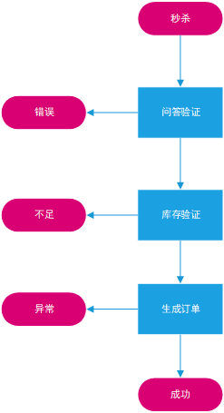

## 1 秒杀系统系统环境搭建

### 1.1 秒杀系统特点

- 人多商品少
- 时间短流量高
- 外挂机器

### 1.2 技术要点

- 瞬时高并发的处理能力
- 多层次的分布式处理能力
- 人机交互与对抗（验证码）

### 1.3 技术选型分析

- Linux + Nginx + PHP + MySQL + redis
- 开源，免费
- 大众普及
- CDN，智能DNS
- 分布式缓存，全国多节点
- 多线路接入
- 负载均衡LVS
- 大型Web集群
- 高效稳定

### 1.4 开发环境

- 开发工具：Eclipse for PHP Developers / PhpStorm / EditPlus
- 部署开发环境：XAMPP / macos brew安装工具 / Linux yum
- 代码管理员：Git / SVN

### 1.5 MySQL 封装类

- 更安全的PDO组件
- 封装常用的增删改查
- 详见class目录

### 1.6 Redis 封装类

- PHP客户端：phpredis / Predis
- 封装基本的redis资源连接和命令
- 详见class文件目录
- [Redis介绍](https://redis.io/documentation)
- [Redis手册](https://redis.io/commands)

### 1.7 调式封装类

- 封装资源类调用：mysql，redis，curl等
- 定制日志，调式日志等
- 详见项目代码

## 2 系统设计

### 2.1 基本功能和流程

- 后台：活动管理/商品管理/订单管理/日志管理
- 前台：商品展示/秒杀/购物车/我的订单
- 安全：验证码/问答

### 2.2 基本功能和流程



### 2.3 数据库设计

- 活动信息表

```
CREATE TABLE `ms_active`(
`id` int(10) unsigned NOT NULL AUTO_INCREMENT COMMENT '活动ID',
`title` varchar(255) NOT NULL COMMENT '活动名称',
`time_begin` int(10) unsigned NOT NULL DEFAULT '0' COMMENT '开始时间',
`time_end` int(10) unsigned NOT NULL DEFAULT '0' COMMENT '结束时间',
`sys_dateline` int(10) unsigned NOT NULL DEFAULT '0' COMMENT '创建时间',
`sys_lastmodify` int(11) unsigned NOT NULL DEFAULT '0' COMMENT '最后修改时间',
`sys_status` int(11) unsigned NOT NULL DEFAULT '0' COMMENT '状态,0待上线，1已上线，2已下线',
`sys_ip` varchar(50) NOT NULL COMMENT '创建人IP',
PRIMARY KEY(`id`)
)ENGING=InnoDB AUTO_INCREMENT=3 DEFAULT CHARSET=utf8 COMMENT='活动信息表';
```

- 商品信息表

```
CREATE TABLE `ms_goods`(
`id` int(10) unsigned NOT NULL AUTO_INCREMENT COMMENT '商品ID',
`active_id` int(10) unsigned NOT NULL DEFAULT '0' COMMENT '活动ID',
`title` varchar(255) NOT NULL COMMENT '商品名称',
`description` text NOT NULL COMMENT '描述信息,文本,要支持HTML',
`img` varchar(255) NOT NULL COMMENT '小图标，列表中显示',
`price_normal` int(10) unsigned NOT NULL DEFAULT '0' COMMENT '原价',
`price_discount` int(10) unsigned NOT NULL DEFAULT '0' COMMENT '秒杀价',
`num_total` int(10) unsigned NOT NULL DEFAULT '0' COMMENT '总数量',
`num_user` int(10) unsigned NOT NULL DEFAULT '1' COMMENT '单个用户限购数量',
`num_left` int(11) NOT NULL DEFAULT '0' COMMENT '剩余可购买数量',
`sys_dateline` int(11) unsigned NOT NULL DEFAULT '0' COMMENT '创建时间',
`sys_lastmodify` int(11) unsigned NOT NULL DEFAULT '0' COMMENT '最后修改时间',
`sys_status` int(10) unsigned NOT NULL DEFAULT '0' COMMENT '状态,0待上线，1已上线，2已下线',
`sys_ip` varchar(50) NOT NULL COMMENT '创建人IP',
PRIMARY KEY(`id`)
)ENGING=InnoDB AUTO_INCREMENT=4 DEFAULT CHARSET=utf8 COMMENT='商品信息表';
```

- 日志信息表

```
CREATE TABLE `ms_log`(
`id` int(10) unsigned NOT NULL AUTO_INCREMENT COMMENT '日志ID',
`active_id` int(10) unsigned NOT NULL DEFAULT '0' COMMENT '活动ID',
`uid` int(10) unsigned NOT NULL COMMENT '用户ID',
`action` varchar(50) NOT NULL COMMENT '操作名称',
`result` varchar(50) NOT NULL COMMENT '返回信息',
`info` text NOT NULL COMMENT '操作详情，json格式保存，比如POST,refer，浏览器等信息',
`sys_dateline` int(11) unsigned NOT NULL DEFAULT '0' COMMENT '创建时间',
`sys_lastmodify` int(11) unsigned NOT NULL DEFAULT '0' COMMENT '最后修改时间',
`sys_status` int(10) unsigned NOT NULL DEFAULT '0' COMMENT '状态,0正常，1异常，2已处理的异常',
`sys_ip` varchar(50) NOT NULL COMMENT '用户IP',
PRIMARY KEY(`id`)
)ENGING=InnoDB AUTO_INCREMENT=4 DEFAULT CHARSET=utf8 COMMENT='秒杀的详细操作日志';
```

- 问答信息表

```
CREATE TABLE `ms_question`(
`id` int(10) unsigned NOT NULL AUTO_INCREMENT COMMENT '日志ID',
`active_id` int(10) unsigned NOT NULL DEFAULT '0' COMMENT '活动ID',
`title` varchar(255) NOT NULL COMMENT '问题描述',
`ask1` varchar(255) NOT NULL COMMENT '问题1',
`answer1` varchar(255) NOT NULL COMMENT '答案1',
`ask2` varchar(255) NOT NULL COMMENT '问题2',
`answer2` varchar(255) NOT NULL COMMENT '答案2',
`ask3` varchar(255) NOT NULL COMMENT '问题3',
`answer3` varchar(255) NOT NULL COMMENT '答案3',
`ask4` varchar(255) NOT NULL COMMENT '问题4',
`answer4` varchar(255) NOT NULL COMMENT '答案4',
`ask5` varchar(255) NOT NULL COMMENT '问题5',
`answer5` varchar(255) NOT NULL COMMENT '答案5',
`ask6` varchar(255) NOT NULL COMMENT '问题6',
`answer6` varchar(255) NOT NULL COMMENT '答案6',
`ask7` varchar(255) NOT NULL COMMENT '问题7',
`answer7` varchar(255) NOT NULL COMMENT '答案7',
`ask8` varchar(255) NOT NULL COMMENT '问题8',
`answer8` varchar(255) NOT NULL COMMENT '答案8',
`ask9` varchar(255) NOT NULL COMMENT '问题9',
`answer9` varchar(255) NOT NULL COMMENT '答案9',
`ask10` varchar(255) NOT NULL COMMENT '问题10',
`answer10` varchar(255) NOT NULL COMMENT '答案10',
`sys_dateline` int(11) unsigned NOT NULL DEFAULT '0' COMMENT '创建时间',
`sys_lastmodify` int(11) unsigned NOT NULL DEFAULT '0' COMMENT '最后修改时间',
`sys_status` int(10) unsigned NOT NULL DEFAULT '0' COMMENT '状态,0正常，1删除',
`sys_ip` varchar(50) NOT NULL COMMENT '发布人IP',
PRIMARY KEY(`id`)
)ENGING=InnoDB AUTO_INCREMENT=4 DEFAULT CHARSET=utf8 COMMENT='问答信息表';
```

- 订单信息表

```
CREATE TABLE `ms_trade`(
`id` int(10) unsigned NOT NULL AUTO_INCREMENT COMMENT '订单ID',
`active_id` int(10) unsigned NOT NULL DEFAULT '0' COMMENT '活动ID',
`goods_id` int(10) unsigned NOT NULL DEFAULT '0' COMMENT '商品ID',
`num_total` int(10) unsigned NOT NULL DEFAULT '1' COMMENT '购买单品数量',
`num_goods` int(10) unsigned NOT NULL DEFAULT '0' COMMENT '订单总金额',
`price_discount` decimal(10,0) unsigned NOT NULL DEFAULT '0' COMMENT '优惠后实际金额',
`time_confirm` int(10) unsigned NOT NULL DEFAULT '0' COMMENT '确认订单时间',
`time_pay` int(10) unsigned NOT NULL DEFAULT '0' COMMENT '支付时间',
`time_over` int(10) unsigned NOT NULL DEFAULT '0' COMMENT '过期时间',
`time_cancel` int(10) unsigned NOT NULL DEFAULT '0' COMMENT '取消时间',
`goods_info` mediumtext NOT NULL COMMENT '订单商品详情,JSON格式保存',
`sys_dateline` int(11) unsigned NOT NULL DEFAULT '0' COMMENT '创建时间',
`sys_lastmodify` int(11) unsigned NOT NULL DEFAULT '0' COMMENT '最后修改时间',
`sys_status` int(10) unsigned NOT NULL DEFAULT '0' COMMENT '状态,0初始状态，1待支付，2已支付，3已过期，4管理员已确认，5已取消，6已删除，7已发货，8已收货，9已完成',
`sys_ip` varchar(50) NOT NULL COMMENT '用户IP',
`uid` int(10) unsigned NOT NULL COMMENT '用户ID',
`username` varchar(50) NOT NULL COMMENT '用户名',
PRIMARY KEY(`id`),
KEY `uid`(`uid`),
KEY `active_id`(`active_id`),
KEY `goods_id`(`goods_id`)
)ENGING=InnoDB AUTO_INCREMENT=4 DEFAULT CHARSET=utf8 COMMENT='订单信息表';
```

### 2.4 交互和页面设计

- 后台：基本的管理功能，数据列表（增删改查）
- 前台：商品展示，抢购，我的订单，购物车，登录等功能
- 安全：防攻击，防作弊，防抢购机器人

### 2.5 你好